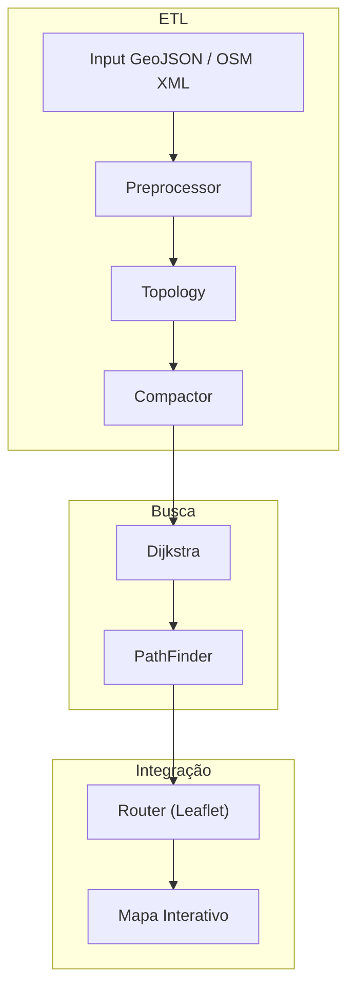

# OSM Pathfinder – Documentação Completa

> Biblioteca TypeScript para cálculo de rotas em dados geoespaciais do OpenStreetMap, com integração simples ao Leaflet.

---

## Autores

- Álvaro Velloso – Lógica e processamento de rotas  
- Thiago Augusto Telho Abreu – Interface gráfica e experiência do usuário  
- Claudio Cristiano Louza Filho – Documentação geral e revisão técnica  

## Sumário

1. [Visão Geral](#visão-geral)  
2. [Principais Funcionalidades](#principais-funcionalidades)  
3. [Arquitetura e Fluxo de Dados](#arquitetura-e-fluxo-de-dados)  
4. [Instalação](#instalação)  
5. [Configuração](#configuração)  
6. [Guia Rápido de Uso](#guia-rápido-de-uso)  
7. [Referência de API](#referência-de-api)  
   - [PathFinder](#pathfinder)  
   - [Router](#router)  
   - [Preprocessor](#preprocessor)  
   - [Compactor](#compactor)  
   - [Dijkstra](#dijkstra)  
   - [Utilitários](#utilitários)  
8. [Requisitos do Trabalho (AED2)](#requisitos-do-trabalho-aed2)  
   - [Requisitos Funcionais (RF)](#requisitos-funcionais-rf)  
   - [Requisitos Não Funcionais (RNF)](#requisitos-não-funcionais-rnf)  
9. [Exemplo Completo](#exemplo-completo)  
10. [Configurações Avançadas](#configurações-avançadas)  
11. [Contribuição e Boas Práticas](#contribuição-e-boas-práticas)  
12. [Licença](#licença)  

---

## Visão Geral

O **OSM Pathfinder** é uma biblioteca modular em TypeScript que:

- Converte dados brutos do OpenStreetMap (GeoJSON) em grafos ajustados.  
- Compacta a topologia para otimizar desempenho.  
- Executa o algoritmo de Dijkstra para localizar o menor caminho.  
- Integra-se ao ecossistema **Leaflet** e **leaflet-routing-machine** com um adaptador (`Router`).  

Ideal para aplicações web de roteirização, GIS e simulações de tráfego.

---

## Principais Funcionalidades

- **Importação Flexível**: aceita GeoJSON, OSM XML e formatos TXT customizados.  
- **Ajuste de Precisão**: `tolerance` configurável para agrupar vértices próximos.  
- **Compactação de Grafo**: remove nós de grau-2 automaticamente.  
- **Personalização de Pesos**: funções definíveis para velocidade e custo de cada via.  
- **API Intuitiva**: métodos `findPath` e `route` para integração imediata.  
- **Estatísticas**: fornece tempo de cálculo, distância total e número de vértices explorados.  

---

## Arquitetura e Fluxo de Dados



- **Preprocessor**: abstrai leitura e conversão de dados.  
- **Topology**: extrai vértices e arestas, arredondando coordenadas.  
- **Compactor**: reduz grafos, preservando bifurcações.  
- **Dijkstra**: retorna sequência de chaves e custo mínimo.  
- **PathFinder**: reconstrói coordenadas reais e metadados.  
- **Router**: adapta `PathFinder` para a interface do `leaflet-routing-machine`.  

---

## Instalação

```bash
# Usando npm
npm install osm-pathfinder geojson @turf/turf leaflet leaflet-routing-machine tinyqueue osmtogeojson

# Usando yarn
yarn add osm-pathfinder geojson @turf/turf leaflet leaflet-routing-machine tinyqueue osmtogeojson
```

Suporta Node.js >= 14 e navegadores modernos.

---

## Configuração

Importe e configure velocidades médias por tipo de via:

```ts
import { HighwaySpeeds } from 'osm-pathfinder';

const speeds: HighwaySpeeds = {
  motorway: 100,
  trunk: 80,
  primary: 60,
  secondary: 50,
  tertiary: 40,
  unclassified: 30,
  residential: 30,
  service: 20,
  living_street: 10,
};
```

Opções adicionais em `PathFinderOptions`:

- `tolerance` (número): precisão de arredondamento de coordenadas.  
- `compact` (boolean): ativa/desativa compactação.  
- `weightFn(edgeData) => number`: define custo de cada aresta.  
- `edgeDataSeed` e `edgeDataReducer`: para agregar propriedades customizadas.  

---

## Guia Rápido de Uso

1. **Carregue o GeoJSON** (ou XML convertido com `osmtogeojson`).  
2. **Instancie** `PathFinder`:
   ```ts
   import PathFinder from 'osm-pathfinder';

   const pf = new PathFinder(osmGeoJson, { speeds, tolerance: 1e-5 });
   ```
3. **Calcule a rota**:
   ```ts
   const result = pf.findPath(
     { type: 'Point', coordinates: [lonA, latA] },
     { type: 'Point', coordinates: [lonB, latB] }
   );
   console.log(result.path);      // Lista de [lon, lat]
   console.log(result.weight);    // Custo total
   console.log(result.edgeDatas); // Metadados por trecho
   ```
4. **Integre ao Leaflet**:
   ```ts
   import { Router } from 'osm-pathfinder';
   import L from 'leaflet';
   import 'leaflet-routing-machine';

   const router = new Router(speeds, osmGeoJson);
   L.Routing.control({ router }).addTo(map);
   ```

---

## Referência de API

### PathFinder

```ts
constructor(network: FeatureCollection<LineString>, options?: PathFinderOptions)
findPath(a: Feature<Point>, b: Feature<Point>): Path | undefined
```

- **network**: GeoJSON de linhas.  
- **options**: `tolerance`, `compact`, `speeds`, `weightFn`.  
- **findPath**: retorna objeto `{ path: Position[]; weight: number; edgeDatas: any[] }` ou `undefined` se sem rota.  

---

### Router

```ts
class Router implements Routing.IRouter {
  constructor(speeds: HighwaySpeeds, network: FeatureCollection<LineString>);
  route(waypoints: Waypoint[], callback: (err, routes) => void): void;
}
```

- **route**: adapta `findPath` para o formato do **leaflet-routing-machine**.  
- **callbacks** recebem lista de rotas com distâncias, tempos e camadas GeoJSON.  

---

### Preprocessor

```ts
function preprocess(
  network: FeatureCollection<LineString>,
  options: PathFinderOptions
): PathFinderGraph
```

- Converte GeoJSON em grafo bruto e opcionalmente compactado.  
- Retorna `vertices`, `edges`, `compactedVertices`, `compactedEdges`, etc.  

---

### Compactor

```ts
function compactGraph<T>(
  topology: Topology<T>,
  options: { weightFn }
): Topology<T>
```

- Remove nós de grau 2 e concatena metadados e coordenadas.  

---

### Dijkstra

```ts
function findPath(
  graph: Vertices,
  start: string,
  end: string
): [number, string[]] | undefined
```

- Implementação baseada em heap mínimo (`tinyqueue`).  
- Retorna custo e sequência de chaves do grafo compacto.  

---

### Utilitários

- **roundCoord(coord: Position, tolerance: number): Position**  
- **Tipos** em `types.ts`: chaves, interfaces `Path`, `RouteInfo`, `PathFinderOptions`, etc.  

---

## Requisitos do Trabalho (AED2)

### Requisitos Funcionais (RF)

| Código | Descrição                                                                                                                                      |
|--------|------------------------------------------------------------------------------------------------------------------------------------------------|
| RF01   | Permitir importar mapas reais (de arquivos `.txt`, `XML`, etc.) contendo coordenadas de vértices e arestas referentes a ruas, avenidas, rodovias e converter para grafos. |
| RF02   | Disponibilizar opção de enumerar os vértices e rotular as arestas com pesos (distâncias).                                                      |
| RF03   | Permitir ao usuário selecionar e desselecionar um vértice de origem e um de destino, com marcação em cores distintas para origem e destino.   |
| RF04   | Calcular e exibir, em cor diferenciada, a rota do menor caminho entre dois vértices usando o algoritmo de Dijkstra.                             |
| RF05   | Permitir criação e edição de grafos dinamicamente, adicionando/removendo vértices e arestas via interação com o mouse.                          |
| RF06   | Suporte a diferentes tipos de grafos: ponderado, não direcionado e direcionado (vias de mão única e mão dupla).                                 |
| RF07   | Exibir estatísticas sobre a execução do algoritmo, incluindo tempo de processamento, número de nós explorados e custo total.                     |
| RF08   | Permitir copiar para a área de transferência a imagem renderizada do grafo em qualquer momento.                                                |

### Requisitos Não Funcionais (RNF)

| Código | Descrição                                                                                                                       |
|--------|---------------------------------------------------------------------------------------------------------------------------------|
| RNF01  | Vértices e arestas devem ter cores distintas para melhor visualização.                                                          |
| RNF02  | Diferenciar visualmente arestas representando vias de mão única das de mão dupla.                                               |
| RNF03  | Otimização de desempenho para suportar grafos grandes (milhares de vértices e arestas).                                         |
| RNF04  | Tempo de resposta para cálculo do menor caminho inferior a 2 segundos em grafos de porte médio (~500 nós).                     |
| RNF05  | Uso eficiente de memória para evitar sobrecarga em grafos extensos.                                                             |

---

## Exemplo Completo

Este exemplo demonstra um fluxo completo de inicialização, cálculo de rota e renderização no Leaflet:

```ts
import L from 'leaflet';
import 'leaflet-routing-machine';
import PathFinder, { HighwaySpeeds } from 'osm-pathfinder';

# (continuação do exemplo conforme necessidade)
```

---

## Configurações Avançadas

- **Desabilitar compactação**: `new PathFinder(data, { compact: false })` – útil para debugging.  
- **Customização de peso**:
  ```ts
  const pf = new PathFinder(data, {
    weightFn: edgeData => edgeData.distance * customFactor(edgeData)
  });
  ```

---

## Contribuição e Boas Práticas

1. **Clonagem e Setup**:
   ```bash
   git clone https://github.com/seu-usuario/osm-pathfinder.git
   cd osm-pathfinder
   yarn install
   ```
2. **Linters e Formatação**: siga ESLint e Prettier.  
3. **Testes Unitários**: adicione casos para `preprocessor`, `compactor` e `dijkstra`.  
4. **Pull Requests**: detalhe a motivação, inclua exemplos e rode `yarn test`.  

---

## Licença

Distribuído sob a **MIT License**. Veja o arquivo `LICENSE` para mais detalhes.

---

*Documentação gerada e revisada para atender aos requisitos formais de um projeto de Engenharia de Software.*  

